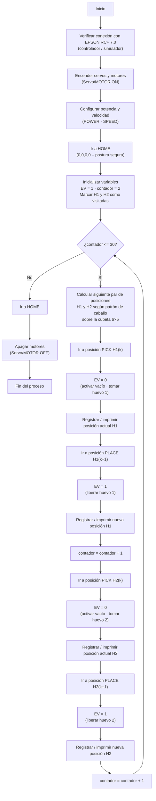

</p>

<h1 align="center">🤖 LABORATORIO 3 – EPSON T3-401S • EPSON RC+ 7.0</h1>

<p align="center"> 
  
  
  
</p>

---

# Descripción general


Este repositorio contiene el desarrollo completo del **Laboratorio Nº3** de *Robótica Industrial 2025-II*:  
**Análisis y operación del manipulador EPSON T3-401S**, comparación con **Motoman MH6** y **ABB IRB140**, práctica de **movimiento manual**, **control de velocidades**, diseño de un **gripper neumático**, uso del software **EPSON RC+ 7.0**, y diseño/ejecución de una trayectoria con patrón de movimiento del **caballo de ajedrez**.

---

# Resultados de aprendizaje

<!-- [!WARNING]
> FALTA agregar imagen resumen comparativa de los tres robots (EPSON T3-401S, Motoman MH6, ABB IRB140).
-->
<p align="center">
  
</p>


- Comparar técnicamente los manipuladores **EPSON T3-401S**, **Motoman MH6** y **ABB IRB140**.  
- Identificar y describir la **configuración HOME del EPSON T3-401S**.  
- Realizar **movimientos manuales** en modos articulares y cartesianos.  
- Cambiar y reconocer **niveles de velocidad** en el software EPSON RC+ 7.0.  
- Describir aplicaciones principales y método de comunicación del **EPSON RC+ 7.0**.  
- Analizar diferencias entre **EPSON RC+**, **RoboDK** y **RobotStudio**.  
- Diseñar un **gripper neumático por vacío** y su conexión a E/S digitales.  
- Implementar una **trayectoria con patrón de caballo** para manipular dos huevos sobre una cubeta 6×5.

---

# Integrantes y Docentes

<!-- ===== INICIO BLOQUE ANIMACIONES EQUIPO (una animación por línea) ===== -->

<!-- Encabezado: Integrantes -->
<p align="center">
  
</p>

<!-- Nombre 1 -->
<p align="center">
  
</p>

<!-- Nombre 2 -->
<p align="center">
  
</p>

<!-- Nombre 3 -->
<p align="center">
  
</p>

<!-- Encabezado: Docentes -->
<p align="center">
  
</p>

<!-- Docente 1 -->
<p align="center">
  
</p>

<!-- Docente 2 -->
<p align="center">
  
</p>

---

# 1. Cuadro comparativo de manipuladores
<!--
> [!WARNING]
> FALTA agregar captura un cuadro comparativo más completo, como el de el lab pasado, pero estos datos parecen ser los básicos que pide el laboratorio.
-->
| Característica | EPSON T3-401S | Motoman MH6 | ABB IRB140 |
|---|---|---|---|
| Tipo | SCARA | Articulado 6 DOF | Articulado 6 DOF |
| DOF | 4 | 6 | 6 |
| Carga útil | 3 kg | 6 kg | 6 kg |
| Alcance | 400 mm | 1422 mm | 800 mm |
| Repetibilidad | ±0.02 mm | ±0.08 mm | ±0.03 mm |
| Velocidad máx | Muy alta (SCARA) | Alta | Media-alta |
| Aplicaciones | Pick & place, ensamblaje | Manipulación, soldadura | Ensamble, manipulación |
| Controlador | EPSON RC+ | DX100 | IRC5 |

---

# 2. Configuración HOME del EPSON T3-401S

El robot **EPSON T3-401S** posee encoders absolutos, por lo que se cuenta con la posiblidad de conocer la posición angular de cada articulación de forma absoluta. La siguiente tabla indica
cuantos pulsos por revolucion corresponden a cada articulación. 

### Pulsos por articulación – EPSON T3-401S

| Articulación | Resolución | Tipo de movimiento | Pulsos por unidad |
|--------------|------------|--------------------|-------------------|
| **J1** | 0.000439 °/pulso | Rotacional | **≈ 820 210 pulsos/rev** |
| **J2** | 0.000439 °/pulso | Rotacional | **≈ 820 210 pulsos/rev** |
| **J3** | 0.000799 mm/pulso | Lineal | **≈ 1252 pulsos/mm** |
| **J4** | 0.005017 °/pulso | Rotacional | **≈ 71 755 pulsos/rev** |

El software de **Epson** requiere definir la posición de **HOME** en valores absolutos, utilizando **pulsos** como unidad para cada articulación.

Para configurarlo:

1. Abra **Herramientas > Administrador de Robot** (atajo **F6**).  
2. En la ventana que aparece, vaya al menú lateral y seleccione **Configuración del HOME**.  

<p align="center">
  
</p>

En esta sección se pueden ingresar manualmente los pulsos a los que se desplazará cada eje cuando se ordene el movimiento a **HOME**.  
Finalmente, presione **Aplicar** para guardar los valores establecidos.

Al escoger **Home** en "Panel de control":
<p align="center">

</p>
El Robot se dirige a la posición mostrada en pantalla:

<p align="center">

</p>

El home usado en este laboratorio tiene 0 pulsos en todas las posiciones articulares, el resultado obtenido una vez acoplado el gripper neumático se observa a continuación:

<p align="center">
  
</p>

La posición HOME se define como la postura de referencia segura del robot SCARA.  

Se usa para:
- Calibración  
- Inicio/fin de ciclo  
- Recuperación ante errores

---

# 3. Movimientos manuales (Jogging)

 Nota:Según sea el caso, el operador debe realizar una configuración adecuada del controlador en el apartado "Conexión" donde podra hacerlo de dos maneras:
 1. Si se trata del robot fisico mediante conexion USB debe serleccionarse en Conexión **USB**.
 2. Si se trata de una simulación del Robot, es necesario crear un controlador virtual.

En el EPSON T3-401S, los movimientos manuales se realizan desde **EPSON RC+ 7.0**. Estos se ejecutan desde la ventana **Administrador de Robot** en la pestaña **Mover y enseñar**. 

<p align="center">
  
</p>

En **Modo:** podemos seleccionar multiples modos de desplazamiento y seleccionar uno de los das dos velocidades disponibles para movimiento manual (**Alta** y **Baja**).

<p align="center">

</p>

Sin embargo, para que el robot tenga la capacidad de ejecutar los movimientos, es necesario encender los motores y seleccionar la potencia de los motores, para esto, presionamos el botón
**MOTOR ON** en la pestaña **Panel de control**. Tengase en cuenta que con la opción de potencia **POWER LOW** la potencia de los motores será menor, algo más apropiado para calibración y teach. 

<p align="center">

</p>

La articulación **J4** siempre opera en **grados**, ya que corresponde al eje rotacional del efector final.  
Por su parte, **J3** trabaja exclusivamente en **milímetros**, debido a que es el eje lineal del robot.  
Las demás articulaciones pueden configurarse directamente en coordenadas angulares o determinarse automáticamente mediante la **cinemática inversa** cuando se realizan movimientos en el espacio de trabajo.

### Modos de movimiento

- **Mundo, Herramienta, Local (X, Y, Z, θ):**  
  Permiten desplazar el robot en el **espacio cartesiano**, seleccionando el marco de referencia desde el cual se interpretan los comandos:  
  - **Mundo:** Coordenadas medidas desde el origen global del sistema.  
  - **Herramienta:** Movimientos definidos respecto al **TCP** (Tool Center Point).  
  - **Local:** Movimientos relativos al **flange** o punto de montaje del efector final.

- **Articular (θ₁, θ₂, Z, θ₄):**  
  Permite controlar cada articulación del robot **SCARA** de forma independiente, asignando valores directos a cada eje según su unidad correspondiente.

El software permite modificar las distancia de movimiento cada vez que se ejecuta una instrucción de movimiento manual. 
<p align="center">

</p>

La interfaz de movimiento cambia según el modo de movimeinto seleccionado, para movimiento en el espacio de trabajo:

<p align="center">

</p>

Mientras que, para movimiento en modo articular, la interfaz toma la siguiente apariencia:

<p align="center">

</p>

En resumen:
1. Activar servo (Servo Power ON).
2. Seleccionar el **Mover y enseñar**.  
3. Elegir entre los Modos en el espacio de configuración o en el espacio de trabajo.
4. Ajustar velocidad de jogging y la magnitud de cada salto.
5. Ejecutar movimientos.

---

# 4. Niveles de velocidad en EPSON RC+ 7.0

En la pestaña **Mover y enseñar** puede configurarse el nivel de velocidad, mientras que en **Panel de control** el nivel de potencia.

### Velocidad: “Alta” vs “Baja”
- **Velocidad Baja:** el robot se desplaza más lento debido a una limitación en el parámetro *Speed*.  
- **Velocidad Alta:** permite un valor de *Speed* mayor, por lo que el movimiento es más rápido.

La velocidad solo determina **qué tan rápido se mueve el robot**, no la fuerza que aplica.

<p align="center">
  
</p>

---

### Potencia: Power LOW vs Power HIGH

Según el manual del Epson T3-401S, este ajuste modifica la **fuerza/torque disponible**, no la velocidad.
- **Power LOW:** el robot trabaja con potencia reducida; limita la fuerza del motor.  
- **Power HIGH:** habilita la potencia completa del motor.

<p align="center">

</p>

La potencia afecta la **capacidad de esfuerzo del robot**, no la velocidad programada.
En la pestaña **Panel de control**, en la sección  **estado** se evidencia el nivel de potencia, por ejemplo, para potencia alta:
<p align="center">

</p>
Mientras que para potencia baja:
<p align="center">

</p>

---

### Relación entre velocidad y potencia

- Puede usarse **velocidad alta con potencia baja**, pero el robot podría no manejar cargas exigentes.  
- Puede usarse **velocidad baja con potencia alta**, útil para mover cargas pesadas de forma controlada.  

En resumen: **potencia y velocidad**.  
Si se solicita mucha velocidad estando en *Power LOW*, el robot puede autolimitarse para evitar sobreesfuerzos.

---

# 5. Software EPSON RC+ 7.0

<p align="center">

</p>

Principales aplicaciones:

- Control directo de movimiento  
- Creación de proyectos  
- Simulación 3D  
- SPEL+  
- Comunicación USB  
- I/O digitales  

### Comunicación con el manipulador:
- Protocolo USB industrial  
- RC+ envía comandos SPEL+  
- El controlador ejecuta las instrucciones programadas.

---

# 6. EPSON RC+ 7.0 vs RobotStudio vs RoboDK

<p align="center">
   
   &nbsp;&nbsp;&nbsp;&nbsp;&nbsp; &nbsp;&nbsp;&nbsp;&nbsp;&nbsp;  &nbsp;&nbsp;&nbsp;&nbsp;&nbsp;  
  

</p>

<div align="center">

| Criterio | EPSON RC+ | RoboDK | RobotStudio |
|---|---|---|---|
| Marca | EPSON | Multimarca | ABB |
| Fidelidad | Alta | Media-Alta | Muy alta |
| Lenguaje | SPEL+ | Python, C# | RAPID |
| Simulación | Básica | Flexible | Industrial 1:1 |
| Uso ideal | Pick & place | Multimarca | ABB avanzado |

</div>


---

# 7. Diseño del gripper neumático

El gripper neumático fue diseñado en conjunto por los estudiantes del grupo del laboratorio (Particular agradecimiento al estudiante Esteban Duran) con el fin de ser impreso en 3d. A continuación se observa el 
gripper fijado al robot en el apartado de simulación del software EPSON RC+

<p align="center">

</p>


El montaje usado se muestra en la siguiente imagen, donde se observa el gripper neumático fijado al robot, en cual está en posición **HOME**.

<p align="center">

</p>


Incluye:

- Ventosa de vacío  
- Válvula 5/2  
- Venturi
- Out_9 del robot  

<p align="center">

</p>

---

# 8. Trayectoria con patrón de caballo (Ajedrez)
<!--
> [!WARNING]
> FALTA plano de planta 2D (**plano_cubeta.svg**).
-->
## Trayectoria escogida

El siguiente grafico muestra una matriz de **5 filas × 6 columnas** (30 celdas en total). Cada celda contiene un cuadro con un número, y ese número corresponde a su índice de posición entre 1 y 30. La no avanza simplemente de izquierda a derecha y cuando llega a la columna final, continua aumentando en la fila de abajo de izquierda a derecha. 

```
Fila 1 → 1,2,3,4,5,6
Fila 2 → 7,8,9,10,11,12
Fila 3 → 13…18
Fila 4 → 19…24
Fila 5 → 25…30
```

Además del cuadro con el índice, cada celda contiene dos círculos, cada uno con un número: representan dos huevos que recorren la matriz. El huevo amarillo es el huevo 1 y el azul es el huevo 2. El número dentro de cada círculo indica **en qué paso** de la secuencia ese huevo estuvo en esa celda.

Ambos huevos se desplazan utilizando un movimiento tipo caballo de ajedrez: dos unidades en una dirección y una en la perpendicular. El huevo 1 inicia en el índice **1** en el paso 1, mientras que el huevo 2 inicia en el índice **30**, también en el paso 1. A medida que avanzan los pasos, cada huevo se mueve a la siguiente celda según la regla del caballo.

Así, el gráfico representa visualmente las trayectorias completas de ambos huevos sobre la matriz. Si en una celda el círculo amarillo tiene un “8”, significa que **en el paso 8 el huevo 1 se encontraba allí**; si el círculo azul muestra un “15”, significa que **en el paso 15 el huevo 2 pasó por esa misma celda**. De este modo, el gráfico permite ver simultáneamente la numeración fija de la matriz y el orden temporal en que cada huevo visitó cada posición.


<p align="center">

</p>

Esta trayectorai se ejecutó 


El montaje final, con el TCP y los puntos utilizados para esta trayectoria se muestra a continuación:

<p align="center">

</p>

### Requerimiento:

Mover dos huevos por toda la cubeta 6×5 usando movimientos tipo L.

---

# 9. Código en SPEL+ (EPSON RC+ 7.0)
<!--
> [!WARNING]
> FALTA captura de pantalla del editor SPEL+ mostrando el archivo `horse_pattern.prg`.
-->


<!--
```spel
REM --- Movimiento tipo caballo para cubeta 6x5 ---

DIM matriz(6,5)
DIM hx, hy

CALL InicializarHuevos()

FOR i=1 TO 30
   CALL MoverHuevo(hx, hy)
   CALL ActualizarCaballo(hx, hy)
NEXT
```
-->
El archivo a continuacion es el codigo ejecutado para realizar las trayectorias solicitadas en el laboratorio, donde se cumple el correcto movimiento tipo caballo ajedrez de los dos huevos el cual pasan en cada una de las posiciones de la bandeja de huevos. 

📄 **Archivo SPEL+** → [Main.prg](Main.prg)


---


==

# 10. Diagrama de flujo del programa de paletizado (patrón de caballo)


```mermaid
flowchart TD

    %% INICIALIZACIÓN
    A["Inicio"] --> B["Verificar conexión con EPSON RC+ 7.0<br/>(controlador / simulador)"]
    B --> C["Encender servos y motores<br/>(Servo/MOTOR ON)"]
    C --> D["Configurar potencia y velocidad<br/>(POWER · SPEED)"]
    D --> E["Ir a HOME<br/>(0,0,0,0 – postura segura)"]

    E --> F["Inicializar variables<br/>EV = 1 · contador = 2<br/>Marcar H1 y H2 como visitadas"]

    %% BUCLE PRINCIPAL
    F --> G{"¿contador <= 30?"}

    G -->|No| H["Ir a HOME"]
    H --> I["Apagar motores<br/>(Servo/MOTOR OFF)"]
    I --> J["Fin del proceso"]

    G -->|Sí| K["Calcular siguiente par de posiciones<br/>H1 y H2 según patrón de caballo<br/>sobre la cubeta 6×5"]

    %% SECUENCIA HUEVO 1 (H1)
    K --> H1A["Ir a posición PICK H1(k)"]
    H1A --> H1B["EV = 0<br/>(activar vacío · tomar huevo 1)"]
    H1B --> H1C["Registrar / imprimir posición actual H1"]
    H1C --> H1D["Ir a posición PLACE H1(k+1)"]
    H1D --> H1E["EV = 1<br/>(liberar huevo 1)"]
    H1E --> H1F["Registrar / imprimir nueva posición H1"]
    H1F --> H1G["contador = contador + 1"]

    %% SECUENCIA HUEVO 2 (H2)
    H1G --> H2A["Ir a posición PICK H2(k)"]
    H2A --> H2B["EV = 0<br/>(activar vacío · tomar huevo 2)"]
    H2B --> H2C["Registrar / imprimir posición actual H2"]
    H2C --> H2D["Ir a posición PLACE H2(k+1)"]
    H2D --> H2E["EV = 1<br/>(liberar huevo 2)"]
    H2E --> H2F["Registrar / imprimir nueva posición H2"]
    H2F --> H2G["contador = contador + 1"]

    %% CIERRE DE CICLO
    H2G --> G
```


# 10. Videos

### Ejecución real y simulación en el EPSON T3-401S  
A continuacion se muestra el video donde se ve el codigo funcionando en el software de simulacion del RC EPSON y a si mismo aplicado en el robot real.

Hacer click en la imagen o en el recuadro abajo de la imagen.
<p align="center">
  <a href="https://www.youtube.com/watch?v=so7Pgv17r1g">
    
  </a>
</p>

<p align="center">
  <a href="https://www.youtube.com/watch?v=so7Pgv17r1g">
    
  </a>
</p>


<!--
---

# Estructura del repositorio

> [!WARNING]
> Verificar que los archivos existan realmente en las carpetas indicadas.

```
📁 /docs
    cuadro_comparativo.pdf
    home_t3.png
    diagrama_gripper.svg
    plano_cubeta.svg

📁 /code
    horse_pattern.prg
    io_config.json

📁 /videos
    simulacion.mp4
    implementacion.mp4
    gripper.mp4

README.md
```

---

# 📝 Licencia

Este repositorio se entrega como requisito académico para el curso Robótica Industrial 2025-II.
